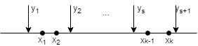

# 3. Простой и вариационный статистические ряды. Статистическое распределение выборки. Информационно-статистическая таблица.
Измерим ,..., и найдем их значения.

 статистические данные

,..., - С.В.

,..., - числа

| N | 1 | 2 | ... | n  |
|---|---|---|-----|----|
| Значение  |  |  | ... |  | 

Это **простой статистический ряд**

Если эти значения упорядочиваются в порядке возрастания, то этот ряд называется **вариационным**

**Вариационный ряд** - сами значения  - варианты.

При наблюдении за дискретными или непрерывными случайными величинами, при округлении их значений может быть много одинаковых значений.
Удобно из этой таблицы выделить только разные значения и посчитать сколько они встречались.

Пусть уникальных будет 

|                      |       |       | ... |       |
|---------------------------------------------------------------------|------------------------------------------------------|------------------------------------------------------|-----|------------------------------------------------------|
|                      |       |       | ... |       |
|  |  |  | ...    |  |

Это **статистическое распределение выборки**.

На практике даже такие таблицы трудно обозримы, а информация в них бывает лишней при решении. Поэтому данные укрупняют.

Расположим данные на оси.
Разобьем интервал от  до  на разряды по S штук

Дальше считают сколько элементов выборки попало в каждый разряд.

| Разряды                                                             |  |  | ... |  |
|---------------------------------------------------------------------|---------------------------------------------------------|---------------------------------------------------------|-----|-----------------------------------------------------------|
|                      |          |          | ... |            |
|  |      |      | ... |        |

Иногда разряды выбираются со спецификой задачи.
Такая таблица называется **информационно статистической** или **группированным статистическим рядом**.
