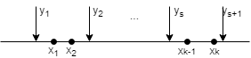

# **ДВУМЕРНЫЕ СЛУЧАЙНЫЕ ВЕЛИЧИНЫ**

# 1. Свойства матрицы распределения вероятностей для дискретной двумерной с.в.  и с.в.  по матрице распределения.

) - двумерная случайная величина.

Для того, чтобы задать двумерную дискретную случайную величину, нужно задать все ее пары, а также все вероятности . Тогда говорят, что задан __Закон рапределения вероятностей двумерной с.в.__

Если с.в. имеет конечное число значений, то вероятности  удобно располагать в виде матрицы (__таблица распределения вероятностей__)

|  \   |            |   |        |         | 
|----------|:------:|------:|------:|------:|------:|
|  |   |  |       |
|  |       |  |       |
|  |
|  | | |  |
|  |
|  | | | | |  |

=P(\xi_{1}=x_{i},&space;\xi_{2}=y_{j}))

Свойства матрицы:

- 
- 

Матрица задает __совместный закон распределения__.

### Утверждение:
Зная совместный закон распределения, т.е. матрицу, можно всегда и однозначно найти законы распределения отдельно для  и 

Построим ряды распределения отдельно для  и 

|   |            |   |        |         | 
|----------|:------:|------:|------:|------:|------:|
| |) |   |  | |      |

=\sum^{m}_{j}P(\xi_{2}=y_{j})P(\xi_{1}=x_{i}/\xi_{2}=y_{j})=P(\xi_{1}=x_{i};\xi_{2}=y_{j})=\sum^{m}_{j=1}P_{ij}) - истинна теорема умножения для зависимых событий

=\sum_{j}P(H_{i})P(A/H_{i})) - функция полной вероятности

Для нахождения величины  нужно сложить все элементы из первого __столбца__, для нахождения  нужно сложить все элементы из i-того __столбца__ и т.д.

Аналогично получается ряд распределения для 

|   |            |   |        |         | 
|----------|:------:|------:|------:|------:|------:|
| |) |   |  | |      |

Для нахождения величины  нужно сложить все элементы из первой __строки__ и т.д.

### Замечание

Но если известны отдельно ряды распределения для  и для , то матрицу восстановить __нельзя__, т.к. обратный переход очень сложный.
# 2. Определение двумерной совместной функции распределения F(x,y), ее свойства.

_{-\infty<x,y<&plus;\infty}=P(\{\xi_{1}<x&space;\}\cap&space;\{\xi_{2}<y&space;\})=P(\xi_{1}<x,\xi_{2}<y)) - **совместная функция распределения**

### **Свойства**:
- \leqslant1,&space;\forall&space;x,&space;\forall&space;y)
- Функция убывает по каждому своему аргументу
- Функция непрерывна слева по каждому своему аргументу
- *Предельные свойства*
  - =&space;F(-\infty,&space;-\infty)=P(\xi_{1}<-\infty,&space;\xi_{2}<-\infty)=P(\O&space;)=0)
  - =&space;F(-\infty,&space;y)=P(\xi_{1}<-\infty,&space;\xi_{2}<y)=P(\O&space;)=0)
  - =&space;F(x,-\infty)=P(\xi_{1}<x,&space;\xi_{2}<-\infty)=P(\O&space;)=0)
  - =&space;F(&plus;\infty,&space;&plus;\infty)=P(\xi_{1}<&plus;\infty,&space;\xi_{2}<&plus;\infty)=P(\Omega&space;)=1)
  - =&space;F(&plus;\infty,&space;y)=P(\xi_{1}<&plus;\infty,&space;\xi_{2}<y)=P(\xi_{2}<y)=F_{\xi_{2}}(y))
  - =&space;F(x,&plus;\infty)=P(\xi{1}<x,\xi_{2}<&plus;\infty)=P(\xi_{1}<x)=F_{\xi_{1}}(x))
- Вероятность попадания с.в. ) в прямоугольник
  
  
  =F(b,d)&plus;F(a,c)-F(b,c)-F(a,d))

### Замечание
Если ) непрерывного типа, то:
- Функция F(x,y) также непрерывна справа по каждому своему аргументу, т.е. является просто непрерывной функцией и по x, и по y.
- Вероятность попадания в прямоугольник будет вычисляться независимо от того, как стоят знаки.

=F_{\xi_1\xi_2}(x,&plus;\infty))
=F_{\xi_1\xi_2}(&plus;\infty,y))

Зная совместную двумерную функцию распределения, можно всегда, и притом однозначно, получить фукнции распределения отдельно для  и для . Неверно в обратную сторону.
# 3. Способ нахождения F(x,y) из матрицы распределения для двумерной дискретной с.в.

Двумерная с.в. ) имеет распределение, заданное матрицей.

|  \  |  -1   |    0 |    1 |
| ------------------------------------------------------------------------------------------------------------------- | :---: | ---: | ---: |
| -1                                                                                                                  |  1/6  |  1/6 |  1/8 |
| 1                                                                                                                   |  1/4  |  1/8 |  1/6 |

|  |             |           -1 |            0 |            1 |
| -------------------------------------------------------- | :--------------------------------------------------------: | -----------: | -----------: | -----------: |
|                                                          | ) | 1/6+1/4=5/12 | 1/6+1/8=7/24 | 1/8+1/6=7/24 |

|  |             |                -1 |                 1 |
| -------------------------------------------------------- | :--------------------------------------------------------: | ----------------: | ----------------: |
|                                                          | ) | 1/6+1/6+1/8=11/24 | 1/4+1/8+1/6=13/24 |

F(x,y) удобно записывать в виде таблицы. Разобьем всю плоскость на прямоугольники следующего вида: ось OX разобьем значениями с.в. , ось OY - значениями .

| y \ x       | x <= 1 | -1 < x <= 0 | 0 < x <= 1 | x > 1 |
| ----------- | :----: | ----------: | ---------: | ----: |
| y <= -1     | 0 (1)  |           0 |          0 |     0 |
| -1 < y <= 1 |   0    |         1/6 |    1/3 (2) | 11/24 |
| y > 1       |   0    |        5/12 |      17/24 | 1 (3) |

1) Элементы первой строки и столба всегда равны 0.
2) Пусть x=1/2, y=0 (любые значения ихз подходящего интервала)
   =P(\xi_1&space;<&space;\frac{1}{2};\xi_2<0)=P(\xi_1=-1;\xi_2=1)&plus;P(\xi_1=0;\xi_2=1)=\frac{1}{6}&plus;\frac{1}{6}=\frac{1}{3})

   Значения 1/6 и 1/6 взяты из первой таблицы.
3) Значение правого нижнего элемента всегда равно 1.
4) Значения в строке и столбце возрастают.
# 4. Определение двумерной непрерывной с.в. Свойства двумерной плотности распределения f(x,y). Формулы, связывающие f(x,y) и F(x,y), и формулы, позволяющие находить плотности с.в.  и с.в.  через f(x,y).

При изучении двумерной непрерывной случайной с.в. ) ее удобно интерпретировать как случайную точку на плоскости, при этом значение  по оси OX, а значение  - по оси OY.

__Непрерывная двумерная с.в.__ - двумерная с.в., значения которой сплошь покрывают некоторую область действительной плоскости или всю эту плоскость.

__f(x,y)__ - двумерная (совместная) плотность распределения вероятностей двумерной с.в. ) 

### Свойства
- &space;\geqslant&space;0,&space;\forall&space;x,&space;\forall&space;y)
- )&space;\in&space;D=\iint_{D}f(U,V)dUdV) - случайная точка попадет в некоторую область D

### Следствия
1. Возьмем в качестве D всю плоскость () и найдем вероятность

)&space;\in&space;R^2=\iint_{D}f(U,V)dUdV=&space;\int_{-\infty}^{&plus;\infty}\int_{-\infty}^{&plus;\infty}f(U,V)dUdV=\int_{-\infty}^{&plus;\infty}\int_{-\infty}^{&plus;\infty}f(x,y)dxdy=1)

2. Нарисуем на плоскости и рассмотрим прямоугольник D

&space;\in&space;D)=P(\xi_1<x,\xi_2<y)(==F_{\xi_1\xi_2}(x,y))=\int_{-\infty}^x\int_{-\infty}^yf(U,V)dUdV)

  2.1. &space;\rightarrow&space;F(x,y))
  2.2. ,f(x,y)=\frac{\partial^2&space;F(x,y)}{\partial&space;x\partial&space;y})

Зная совсместную плотность, можно всегда и притом однозначно найти плотность отдельно для  и для 

- =\int_{-\infty}^{&plus;\infty}f(x,y)dy)
- =\int_{-\infty}^{&plus;\infty}f(x,y)dx)

### Замечание

Но зная отдельно ) и ) в общем случае нельзя найти )
# 5. Понятие независимости двух с.в. Критерии независимости для дискретных и непрерывных с.в.

Случайные величины называются независимыми, если:

=F_\xi_1(x)F_\xi_2(y))

=F_{\xi_1\xi_2}(x,&plus;\infty);&space;F_\xi_2(y)=F_{\xi_1\xi_2}(&plus;\infty,y))

### Следствия
1. Для двумерных дискретных с.в. (__Критерий независимоссти дискретных с.в.__)

   
   

   Если  и  дискретные с.в., то для того, чтобы они были независимы, необходимо и достаточно, чтобы  выполнялось условие:

   
2. Для непрерывных с.в.

  Для того, чтобы непрерывные с.в.  и  были независимы, необходимо и достаточно:

  =f_\xi_1(x)f_\xi_2(y))
# 6. Пример нахождения условных законов распределения для двух дискретных с.в.

Если   независимы, то  ведет себя так, будто  не существует, и наоборот.

Рассмотрим случай, когда  и  зависимы. Тогда распределение одной будет зависеть от того, какое значение приняла другая с.в.

Пусть ) - дискретная с.в.

   
   

Пусть  приняла значение , т.е. . Найдем условный закон распределения , при условии . Это будет набор из следующих условных вероятностей:

Набор этих условных вероятностей - __условный закон распределения__ для . Аналогично находится и для .

### Замечание

В любом условном законе сумма условных вероятностей равна 1.

### Способ нахождения условной вероятности для 

=\frac{P(\xi_1=x_1;\xi_2=y_j)}{P(\xi_2=y_j)}), где верхняя часть равна в матрицы, а нижняя находится с помощью той же матрицы.

### Замечание

Для того, чтобы найти матрицу распределения для 2 дискретных с.в., нужно знать безусловный закон распределения для  и все условные законы распределения для .

## Примеров нет, импровизируйте.
# 7. Способ задания условных законов распределения для двух непрерывных с.в., пример.

Пусть ) - двумерная непрерывная с.в.

Условный закон распределения для с.в. , при условии, что  приняла значение y, задается __условной плотностью распределения )__.

=\frac{f_{\xi_1,\xi_2}(x,y)}{f_{\xi_2}(y)}&space;\Rightarrow&space;f_{\xi_1,\xi_2}(x,y)=f_{\xi_1/\xi_2}(x/y)f_{\xi_2}(y)) - по __теореме умножения плотностей__.

Аналогично для y.

### Замечание

Для нахождения двумерной (совместной) плотности, нужно знать безусловную плотность одной с.в., и условную плотность другой.

## Теорема умножения для плотностей

Если  независимы, то как для дискретной с.в., так и для непрерывной с.в. по определению получим, что __все условные вероятности равны безусловным__.

## Пример

# 8. Основные числовые характеристики двумерной с.в. и формулы для нахождения центра рассеивания, величины разброса по осям, ковариации и корреляционной матрицы.

## Центр разброса (рассеивания)

Точка на плоскости с координатами )

## Величина разброса

Для вычисления  удобно найти отдельно закон распределения для  и для . Потом взять формулы для одномерных с.в.

 - по OX.
 - по OY.

## Ковариация с.в.

## Корреляция (нормированная ковариация)

=\frac{COV(\xi_1,\xi_2)}{\sqrt{D(\xi_1)}\sqrt{D(\xi_2)}}=\frac{COV(\xi_1,\xi_2)}{\sigma\xi_1\sigma\xi_2})

Величина corr характеризует степень _линейной_ зависимости между  и 

### Свойства корреляции

1. 
2. Пусть  связаны __жесткой (функциональной) линейной зависимостью__.

  

  В этом случае ) будет максимальна по модулю.

  

3. Обратное к предыдущему свойству.

  Если , то между  __обязательно__ есть жесткая линейная зависимость.

4.Если  независимы, то corr=0.

  =\frac{COV(\xi_1\xi_2)}{\sigma\xi_1\sigma\xi_2}=\frac{M(\xi_1\xi_2)-M(\xi_1)M(\xi_2)}{\sigma\xi_1\sigma\xi_2}=0)

5. Обратное к предыдущему свойству.

  Если corr=0, то это __не означает__, что с.в. независимы.

  - Если corr > 0, то говорят, что  связаны __положительной корреляцией__, т.е. при возрастании одной с.в. возрастает и другая
  - Если corr < 0, то говорят, что  связаны __отрицательной корреляцией__, т.е. при возрастании одной с.в. другая убывает.
  - Если corr = 0, то говорят, что  __некоррелированы__, т.е. между ними нет линейной зависимости.

# Корреляционная матрица

 - корреляционная матрица

=M((\xi_2-M\xi_2)(\xi_-M\xi_1))=&space;cov(\xi_1,\xi_2))

) и ) находятся аналогично.

=M(\xi_1,\xi_2)-M\xi_1M\xi_2)

1. =&space;M\xi_1M\xi_2&plus;cov(\xi_1,\xi_2))

   - независимы =M\xi_1M\xi_2)

2.  - независимы =D\xi_1&plus;D\xi_2)

  
3.  - зависимы

  =D\xi_1&plus;D\xi_2&plus;cov(\xi_1\,\xi_2))
# 9. Свойства корреляции двух с.в.

## Корреляция (нормированная ковариация)

=\frac{COV(\xi_1,\xi_2)}{\sqrt{D(\xi_1)}\sqrt{D(\xi_2)}}=\frac{COV(\xi_1,\xi_2)}{\sigma\xi_1\sigma\xi_2})

Величина corr характеризует степень _линейной_ зависимости между  и 

### Свойства корреляции

1. 
2. Пусть  связаны __жесткой (функциональной) линейной зависимостью__.

  

  В этом случае ) будет максимальна по модулю.

  

3. Обратное к предыдущему свойству.

  Если , то между  __обязательно__ есть жесткая линейная зависимость.

4.Если  независимы, то corr=0.

  =\frac{COV(\xi_1\xi_2)}{\sigma\xi_1\sigma\xi_2}=\frac{M(\xi_1\xi_2)-M(\xi_1)M(\xi_2)}{\sigma\xi_1\sigma\xi_2}=0)

5. Обратное к предыдущему свойству.

  Если corr=0, то это __не означает__, что с.в. независимы.

  - Если corr > 0, то говорят, что  связаны __положительной корреляцией__, т.е. при возрастании одной с.в. возрастает и другая
  - Если corr < 0, то говорят, что  связаны __отрицательной корреляцией__, т.е. при возрастании одной с.в. другая убывает.
  - Если corr = 0, то говорят, что  __некоррелированы__, т.е. между ними нет линейной зависимости.
___
___
___
___
# **МАТЕМАТИЧЕСКАЯ СТАТИСТИКА**
# 1. Предмет математической статистики. Специфика ее задач по сравнению c задачами теории вероятностей. Три основные задачи математической статистики.
**Математическая статистика** - раздел Теории вероятностей, в котором разрабатываются приемы и методы сбора, обработки и анализа экспериментальных данных с целью построения на основе этих данных адекватной вероятностной модели изучаемого случайного явления.

Математическая статистика имеет очень большую область практического применения. Она выделяется в отдельный раздел так как решает специфические задачи по сравнению с теми что решает Теория Вероятности. Их можно назвать обратными к задачам Теории вероятности.

|      | Имеем                                                | Рассчитываем                                                |
| ---- | ---------------------------------------------------- | ---------------------------------------------------------- |
| Т.В. | Вероятностная модель. Вероятность случайного события | Реальное течение процесса.  Частота происхождения процесса |
| М.С. | Реальные числовые данные                             | Подходящую адекватную вероятностную модель                 |

Основные типы задач решаемые В математической статистике:

1. Нахождение статистических законов распределения и статистических числовых характеристик
2. Оценивание неизвестных параметров распределения по статистическим данным
3. Проверка тех или иных предположений о законах распределения или параметрах этого распределения. Проверка статистических гипотез.
# 2. Понятие генеральной совокупности и выборки. Независимая выборка.
**Генеральная совокупность**  - множество элементов одинаковой физической природы для которых изучаются свойства некоторого их количественного признака.
N - **количество элементов**, объем 

Количественный признак  - случайная величина.

Выберем из  определенным образом n элементов.
V - **выборка**, n - **объем выборки**.

Обозначим количественные признаки:
Для первого элемента 
Для второго элемента 
...
Для n-го элемента 

,..., - это не новые случайные величины, а переобозначенная  (Экземпляр С.В.)

Все ,..., одинаково распределены, так же как и  одинаковые числовые характеристики.

### Основное правило получения выборки:
* Каждый элемент генеральной совокупности должен иметь равное право попасть в выборку.

Выборка должна быть репрезентативной **(адекватно представлять генеральную совокупность)**
Это правило обеспечивает независимость всех С.В. ,...,

Независимые, одинаково распределенные и упорядоченные С.В. ,..., называются **повторной выборкой** объема n из .

Будем использовать только ее. ()
# 3. Простой и вариационный статистические ряды. Статистическое распределение выборки. Информационно-статистическая таблица.
Измерим ,..., и найдем их значения.

 статистические данные

,..., - С.В.

,..., - числа

| N | 1 | 2 | ... | n  |
|---|---|---|-----|----|
| Значение  |  |  | ... |  | 

Это **простой статистический ряд**

Если эти значения упорядочиваются в порядке возрастания, то этот ряд называется **вариационным**

**Вариационный ряд** - сами значения  - варианты.

При наблюдении за дискретными или непрерывными случайными величинами, при округлении их значений может быть много одинаковых значений.
Удобно из этой таблицы выделить только разные значения и посчитать сколько они встречались.

Пусть уникальных будет 

|                      |       |       | ... |       |
|---------------------------------------------------------------------|------------------------------------------------------|------------------------------------------------------|-----|------------------------------------------------------|
|                      |       |       | ... |       |
|  |  |  | ...    |  |

Это **статистическое распределение выборки**.

На практике даже такие таблицы трудно обозримы, а информация в них бывает лишней при решении. Поэтому данные укрупняют.

Расположим данные на оси.
Разобьем интервал от  до  на разряды по S штук

Дальше считают сколько элементов выборки попало в каждый разряд.

| Разряды                                                             |  |  | ... |  |
|---------------------------------------------------------------------|---------------------------------------------------------|---------------------------------------------------------|-----|-----------------------------------------------------------|
|                      |          |          | ... |            |
|  |      |      | ... |        |

Иногда разряды выбираются со спецификой задачи.
Такая таблица называется **информационно статистической** или **группированным статистическим рядом**.
# 4. Эмпирическая функция распределения, ее свойства. Полигон относительных частот и гистограмма.

У любой С.В. есть функция распределения
=P(\xi<x),&space;x\in&space;R)

) - **эмпирическая/статистическая функция распределения**

=P^{*}(\xi<x)=\frac{m(x)}{n}) 

n - общее количество элементов выборки

m(x) - число элементов выборки которые строго меньше x

**Свойства** такие же как и у F(x), график такой же как и у Д.С.В.:

1. \leq&space;1)
2. Функция является неубывающей по своему аргументу \leq&space;F(x_{2}))
3. Непрерывна слева
=F(x_{0}))
Если ξ – непрерывная С.В., то ее функция распределения является непрерывной и справа.
4. =0)

    =1)
5. =F(\beta)-F(\alpha))
Для дискретной С.В. справедлива только при таких знаках. При Н.С.В. – знаки могут быть любые (<; <), (<; <=), (<=; <), (<=; <=)

_________
Пусть ξ – Д.С.В.

**Многоугольник распределения**

|                      |      |      | ... |      |
|---------------------------------------------------------------------|-----------------------------------------------------|-----------------------------------------------------|-----|-----------------------------------------------------|
|                      |      |      | ... |      |
|  |  |  | ... |  |

**Полигон относительных частот** - статистический аналог многоугольника распределения 
_________

Пусть ξ – непрерывная С.В.

f(x) - плотность
Эмпирическая плотность/**гистограмма** - аналог плотности.

Для построения гистограммы, полученные данные нужно записать в виде информационно статистической таблицы.

| Разряды           |  |  | ... |  |
|------------------|----------------|------------|-----|---------------|
|      |      |      | ... |         |
|  |    |    | ... |        |

Для каждого i-го разряда посчитаем 

 - длинна i-го разряда

Площадь этой фигуры = 1
# 5. Статистические аналоги для математического ожидания, дисперсии, начальных и центральных моментов. Формулы для их вычисления в зависимости от способа представления данных.

Статистические аналоги Mξ и Dξ - M\*ξ и D\*ξ.
Их формулы похожи на Mξ и Dξ Д.С.В.

1. Данные представлены в виде простого или вариационного ряда
,,...,

^{2}=\frac{1}{n}\sum_{i=1}^{n}x_{i}^{2}-(M\xi&space;^{*})^{2})

2. Данные в виде статистического распределения в выборке
,,...,

^{2}=\frac{1}{n}\sum_{i=1}^{k}n_{i}*x_{i}^{2}-(M\xi&space;^{*})^{2})

3. Данные в виде информационно-статистической таблицы

Используя эту таблицу строим таблицу следующего вида: для каждого разряда найдём его середину 

|       |          |     | ... |              |
|-------------------------------|---------------------------|-------------------|-----|----------------------|
|  |  |  | ... |  |

 - статистический **аналог начального момента** k-го порядка

 - статистический **аналог центрального момента** k-го порядка

^{k})

# 6. Статистические оценки параметров. Требования несмещенности, состоятельности и эффективности в некотором множестве оценок. Понятие сходимости по вероятности случайной последовательности. Основные теоремы для проверки состоятельности оценок.

Пусть для случайной величины ξ признака генеральной совокупности, известна точность распределения до параметров

,m\geq1)

С помощью методов математической статистики найти параметры нельзя. Можно только оценки для этих параметров.
Выберем из генеральной совокупности n элементов и получим n экземпляров

,...,

**Оценка**  - )

)

...

)

Все это статистические оценки для параметров. Функции от С.В. => они сами являются С.В.

### Требования к оценкам
1. **Понятие несмещенности оценки**

)

Если для любого n=1,2,..., =a), то оценка называется **несмещенной**.

2. **Понятие состоятельности оценки**

Говорят, что последовательность  сходится по вероятности к неслучайной величине А, если при , 

последовательность из вероятностей
,P(|\xi_{2}-A|<\varepsilon),...,P(|\xi_{n}-A|<\varepsilon)\rightarrow1)

=1)

:

)

)

При изменении n от 1 до бесконечности, возникает последовательность оценок 
Если эта последовательность сходится по вероятности к а

, то построенная оценка называется **состоятельной**

___
На практике используются 3 **теоремы состоятельности**:

- **Теорема Чебышева**
 - последовательность, имеющая одинаковые С.В.

Образуем С.В. 

Последовательность  сходиться при  к m

- Если оценка  является состоятельной для параметра a, то для любой непрерывной функции g, оценка ) будет состоятельной для параметра g(a).

- Пусть  является несмещенной оценкой для параметра a и \underset{n\rightarrow\infty}{\rightarrow}0), тогда оценка  будет состоятельной для параметра a.
___
3. Понятие **Эффективности** оценки в множестве оценок

Предположим, что для

существуют несмещенные оценки.

Из них нужно взять ту, у которой меньше Дисперсия . Оценка называется **эффективной** на некотором множестве, если она имеет наименьшую Дисперсию .
# 7. Оценка генеральной средней: свойства, формулы для вычисления.

Часто оцениваемым параметром является 

 - оценка

### Здесь на экзамене возможно нужно будет расписать и показать, что эта оценка хорошая (спросить на консультации)
# 8. Точность и надежность несмещенной оценки для математического ожидания. Три задачи и их решение.

Покажем, что эта оценка хороша

1. **Несмещенность**
=M\xi) - выполняется

=\frac{1}{n}(M\xi_{1}&plus;M\xi_{2}&plus;...&plus;M\xi_{n})=\frac{1}{n}*n*M\xi=M\xi)

2. **Состоятельность**

n = 1, 2, ...,

Получится последовательность оценок 

По Т. Чебышева.

Выполнены условия теоремы Чебышева из нее непосредственно следует это равенство.

3. **Эффективность**

Рассмотрим свойства асимптотической эффективности.

)

Если при , \rightarrow0), то оценка асимптотически эффективна.

4. **Точность и надежность**

=\gamma)

Где  - С.В.

 - Случайное событие

Можно показать что в этом случае Гамма вычисляется по формуле:

)

=\frac{2}{\sqrt{2\pi}}*\int_{0}^{x}e^{-\frac{t^{2}}{2}}dt)

* Для того чтобы увеличить гамму, из графика видно, что нужно увеличить аргумент X.
Если ε задана, Dξ = const, то существует единственный способ - увеличение n.
* В формуле стоит Dξ. На практике мы ее не знаем, следовательно заменяем ее оценкой Dξ.
* Полученное равенство можно рассматривать как некоторые уравнения связывающие , ε и n.
___
### Три задачи
1. Знаем ε и n.
 = ?

| x      | ) |
|--------------|------------|
|  |  |

2. Знаем  и n.
ε = ?

| x   | )           |
|----------|----------|
|  |  |

3. Знаем  и ε.
n = ?

| x   | )           |
|----------|----------|
|  |  |

# 9. Смещенная и несмещенная оценки для генеральной дисперсии: свойства, формулы для вычисления.

Dξ - **генеральная дисперсия**.

Строим оценку.

1.  - известно

Тогда ^{2})

- Покажем, что оценка **несмещенная**

=\frac{1}{n}((\xi_{1}-a)^{2}&plus;(\xi_{2}-a)^{2}&plus;...&plus;(\xi_{n}-a)^{2})=\frac{1}{n}*n*D\xi=D\xi)

- \underset{n\rightarrow\infty}{\rightarrow}0) - **асимптотически эффективна**

- **Состоятельность**

Из a, b и Теоремы #3 - оценка состоятельна
___
##### Теорема #3
Пусть  является состоятельной для параметра a и \underset{n\rightarrow\infty}{\rightarrow}0), тогда оценка  будет состоятельной для параметра a.
___
2. Mξ - неизвестно

Предложим оценку

^{2})

Где 

Проверим ее несмещенность

=\frac{1}{n}\sum_{i=1}^{n}(\xi_{i}-\widetilde{M\xi})^{2}=...=\frac{n-1}{n}D\xi\neq&space;D\xi) - не будет несмещенной => не подходит.

Исправим 

^{2}) - несмещенная, состоятельная, асимптотически эффективная

# 10. Точность и надежность несмещенной оценки для дисперсии. Три задачи и их решение.

Для точного нахождения гамма, нужно знать Dξ и четвёртый центральный момент.

Используем приближенную формулу для нахождения гамма.

=\Phi(\frac{\varepsilon\sqrt{n-1}}{\sqrt{2}D\xi}))

Точная формула, если ξ распределена по нормальному закону.

В этой формуле мы не знаем Dξ, поэтому заменяем ее несмещенной оценкой.

С помощью этого уравнения решаются те же самые 3 задачи.

### Три задачи
1. Знаем ε и n.

 = ?

| x      | ) |
|--------------|------------|
|  |  |

2. Знаем  и n.

ε = ?

| x   | )           |
|----------|----------|
|  |  |

3. Знаем  и ε.

n = ?

| x   | )           |
|----------|----------|
|  |  |

___
### Нахождение

^{2})

По этим формулам найдем смещенную оценку .

# 11. Оценка для вероятности: ее свойства, точность и надежность.

Пусть имеется случайный эксперимент

=?)

Задача: требуется построить оценку

)

Проведем эксперимент 1ый раз. Пусть с.в.  - число появлений события А в первом опыте

Проведем 2ой раз.  с.в.  - число появлений события А во втором опыте. Имеет тоже самое распределение как 

и т.д.
Проведем n-ый раз, получим . Она имеет тоже самое распределение (Бернулливская св???)

Посчитаем их сумму

 - общее количество наступления события А

 - относительная частота наступления события А

### Покажем, что эта оценка удовлетворяла всем требованиям, чтобы она была "хорошей"

=&space;pq)

#### 1. Несмещенность
=\frac{1}{n}(M_{\xi&space;_{1}}&plus;&space;M_{\xi&space;_{2}}&space;&plus;&space;...&space;&plus;&space;M_{\xi&space;_{n}})&space;=&space;\frac{1}{n}&space;\cdot&space;np&space;=&space;p)
#### 2. Асимптотическая эффективность
=\frac{1}{n^{2}}(D_{\xi&space;_{1}}&plus;&space;D_{\xi&space;_{2}}&space;&plus;&space;...&space;&plus;&space;D_{\xi&space;_{n}})&space;=&space;\frac{1}{n^{2}}&space;\cdot&space;npq&space;=&space;\frac{pq}{n})

&space;=&space;0)

#### 3. Состоятельность
Из 1, 2 по теореме 3 следует состоятельность

#### 4. 
&space;=&space;...&space;=&space;\Phi&space;(\frac{\varepsilon&space;\sqrt{n}}{\sqrt{pq}}))

p, q - мы не знаем. p, q мы заменяем оценками.

Предположим, что опыт провели n раз и n раз наблюдали событие А. Тогда относительная частота будет

)}}))

Мы можем решить те же 3 задачки, рассматриваемые ранее 
Задача:  - известны, нужно найти n. 

, то 
# 12. Метод моментов для построения оценок неизвестных параметров распределения.

#### Теоретические моменты

 

Записывают так:

,&space;\beta&space;_{k}\xi(a_{1},a_{2},...,a_{m}))

#### Статистические моменты

 - **начальный момент n-го порядка**

^{k};\bar{x}=\frac{1}{n}\sum_{i=1}^{n}x_{i})

### Метод моментов

Если неизвестных параметров М, то нужно найти М любых теоретических моментов, а затем по выборке  посчитать соответствующие им статистические моменты.

Далее их нужно приравнять. Получим систему из М уравнений с М неизвестными. 

Ее нужно решить относительно 

Возможно несколько случаев:

1. Решение единственно 

Утверждается, что эти оценки будут состоятельными, решение единственно

2. Решений несколько

Тогда в качестве оценок можем взять любое из них. Но в этом случае ничего о состоятельности сказать нельзя.

3. Система не имеет решений.

Говорим, что решений по методу оценок не существует.
При решении задач рекомендуется брать простые моменты
# 13. Метод максимального правдоподобия для построения оценок. (или "Максимума") 

#### Суть: 
Строится так называемая **функция правдоподобия**, которая зависит от некоторых параметров

Далее у этой функции находятся такие параметры  , которые обеспечивают максимум и эти значения берутся в качестве оценок максимального правдоподобия

Пусть
1) )

получим выборку 

=\prod_{i=1}^{n}p(\xi=x_{i},&space;a_{1},a_{2},..,a_{m}))

2) )

получим выборку 

Считаем эту плотность для полученных значений
=\prod_{i=1}^{n}f_{\xi}(x_{i},a_{1},a_{2},..,a_{m}))

Часто в практических задачах L- дифференцируема по параметрам 

Тогда для нахождения критических точек используют:

Есть свойство, если f(x)>0 и Lnf(x) - имеют одни и те же точки экстремума.

Рекомендуется находить точки экстремума не самой функции L, а у Ln(L) - это проще

Обычно находят так :

# 14. Точечные и интервальные оценки. Доверительные интервалы.

Оценки, которые задаются одним числом называться **точечными**. Если объем выборки n большой, то оценки дают достаточно хорошие результаты. 

Если n маленькое, то надежность этих оценок  является маленькой.

Увеличить надежность можно только увеличив объем выборки. Но существует множество задач, в которых новые измерения дорогостоящие. В этом случае вместо точечных оценок строят **интервальные оценки**.

Вместо одного числа предлагают целый интервал.
параметр  точечная оценка

), где  - **точечная оценка**

Если  - это хорошо.

 (1)

) - **доверительный интервал**, который покрывает неизвестный параметр а с данной надежностью 

Увеличиваем надежность, тогда теряем точность (интервал)

Доверительный интервал - интервальная оценка.

Заметим, из (1) полученный интервал всегда является симметричным относительно оценки.

Задача сводится к нахождению 

 - Дано. То есть мы подгоняем интервал под надежность
# 15. Построение доверительных интервалов для неизвестного математического ожидания нормального распределения при известной дисперсии.

#### Построение доверительных интервалов для неизвестного параметра а нормального распределения при известном параметре 

=\frac{1}{\sqrt{2\pi&space;}\sigma&space;}&space;\cdot&space;e^{\frac{-(x-a)^2}{\sigma&space;^{2}}})

 - известная

требуется построить доверительный интервал ), покрывающий неизвестный параметр a с заданной надежностью  по выборочным значениям 

Имеем:

Тогда =p(\left&space;|&space;\tilde{M_{\xi&space;}}&space;-&space;M_{\xi}\right&space;|<\varepsilon&space;)=...=\Phi&space;(\frac{\varepsilon&space;\sqrt{n}}{\sqrt{D_{\xi&space;}}})=\Phi&space;(\frac{\varepsilon&space;\sqrt{n}}{\sigma&space;}))

&space;\rightarrow&space;\varepsilon&space;-&space;?)

По функции Лапласа по ) получаем x ( по  получаем )

Раскрываем модуль:

Подставляем:

Пусть задана выборка (конкретные числа): 

Нужно посчитать их среднее арифметическое 

И подставим так:

### Замечание:
Полученную формулу для доверительного интервала можно использовать для любого параметра
# 16. Статистические гипотезы. Основные определения: нулевая, альтернативная, простая и сложная. Критерий согласия, критическая область.

**Статистической гипотезой** называется предположение о законе распределения или о параметре распределения случайной величины 

**Нулевая гипотеза**  - основное выдвинутое предположение

 - **альтернативная или конкурирующая гипотеза** (предположение, противоречащее  )

Гипотеза называется **простой**, если она точно формулирует, и законы распределения, и все его параметры.
В противном случае называется **ложной** 

Для проверки гипотез выбирается **критерий согласия** - случайная величина, которая определяет правила проверки и закон распределения, который не зависит от гипотезы, которую мы выдвигаем

 - **критической областью** называется множество значений этой случайной величины, при которой эта гипотеза отвергается.

#### Правило проверки.

Для проверки получаем независимую выборку  По этим полученным данным получаем значение критерия согласия
Более подробно в следующем билете
# 17. Правило проверки гипотезы. Ошибки первого и второго рода. Уровень значимости и мощность критерия.

#### Правило проверки.
Для проверки получаем независимую выборку  По этим полученным данным получаем значение критерия согласия

Если это значение попало в критическую область , то гипотезу  отвергаем и принимаем  .

Если значение критерия не попало в критическую область, то принимаем

При проверки гипотез можно сделать ошибки двух видов:

1. **Ошибка первого рода**.

Будет отвергнута  при условии, что она верна.
Вероятность этой ошибки называется **уровнем значимости критерия**  - всегда задается постановщиком задачи (обычно 0,05 0,1)

2. **Ошибка второго рода**.

Будет принята  при условии, что верна  . Вероятность этой ошибки  - **оперативная характеристика критерия** по отношению к  . Обычно рассматривается ) - вероятность принять  при условии, что она верна

Обычно рассматривается ) - **мощность критерия** (вероятность правильного решения)

#### Основная задача проверки гипотез
Сконструировать такой критерий согласия, который бы при заданном уровне  обеспечивал бы большую мощность
# 18. Критерий согласия Пирсона для дискретных случайных величин.

### Проверка гипотезы о законе распределения при помощи критерия ("Хи-квадрат") Пирсона (Согласия Пирсона)

Пусть гипотеза : случайная величина  имеет функция распределения =) - формула (не важно какая)

Гипотеза : функция распределения - другая формула

Требуется проверить  с заданным уровнем значимости 

1) Рассмотрим случай, когда  - дискретная случайная величина. (второй случай в следующем билете)

Произведем n измерений этой случайной величины

|   |   |   | ...  |   |
|---|---|---|---|---|
|   |   |   | ...  |   |
|   |    |    | ...  |    |

Используя функцию распределения  посчитаем вероятности:

**Мера расхождения** между ними:

^2)

 - **веса, константы**

Пирсон предложил в качестве  взять величину 

^2&space;=&space;...&space;=\sum_{i=1}^{k}\frac{(n_{i}-np_{i})^2}{np_{i}})

В этой формуле  есть случайные величины

Тогда R - это случайная величина

Пирсон доказал, что данная случайная величина при достаточно больших значений n не зависит
от функции ) и имеет распределение 

Пусть случайные величины  являются независимыми и все они имеют стандартное нормальное распределение

(2 - это не квадрат, а обозначение)

Параметр r - называют **число степеней свобод**

Для нее составлено много разных таблиц, которыми мы можем пользоваться. Для использования этого критерия нужно найти число степеней свободы r

Если в гипотезе  указаны все параметры распределения точно, то число степеней свободы r вычисляется по формуле  

Если в гипотезе  не все параметры указаны точно и S параметр приходится считать по выборке  

#### Правила применения критерия  на практике

1. По полученным данным, где в таблице конкретные числа нужно вычислить R наблюдаемое

^2}{np_{i}})

(это будет число, а не св)

2. Высчитываем r=k-1-S

3. Далее есть 2 пути (в зависимости от таблиц)

I. Есть таблица критических точек

В ней  - дано, а r мы высчитываем. По этим данным находим в ней 

Далее сравниваем:

Если R наблюдаемое  , то данные полученные не согласуются с гипотезой  и ее следует отвергнуть.

В противном случае(<) - данные согласуются и гипотезу следует принять

II Другие таблицы

сверху - r, слева - R наблюдаемое, на пересечении вероятности P

)

Если  , то гипотезу  отвергаем, если , то гипотезу принимаем

  - берут больше нуля
# 19. Критерий согласия Пирсона для непрерывных случайных величин.

### Проверка гипотезы о законе распределения при помощи критерия ("Хи-квадрат") Пирсона (Согласия Пирсона)

Пусть гипотеза : случайная величина  имеет функция распределения =) - формула(не важно какая)

Гипотеза : функция распределения - другая формула

Требуется проверить  с заданным уровнем значимости 

2) Рассмотрим случай, когда  - непрерывная случайная величина. (первый случай в предыдущем билете)

Получим n значений этой случайной величины . Т.к.  - непрерывная, то вообще говоря одинаковых среди них быть не должно. Для того, чтобы применить критерий нужно обязательно построить группированный ряд:

| )  | )  |  ) | ...  |  ) |
|---|---|---|---|---|
|   |   |   | ...  |   |

 - число точек, попавших в разряд

На практике берем 3-4 разряда

В этом случае взяли k разрядов

Рассмотрим случайную величину ^2}{np_{i}})

Используя данные нашей таблички подставим   и вычислим R наблюдаемое. Где k - число разрядов, которые мы выбрали сами.

n - число выборки

  - вероятность, что  (??) попадет в i-ый разряд

Вычисляется согласно гипотезе 

r - число степеней свобод - считается также как и с д.с.в.

Остальное считается также как и с д.с.в.
